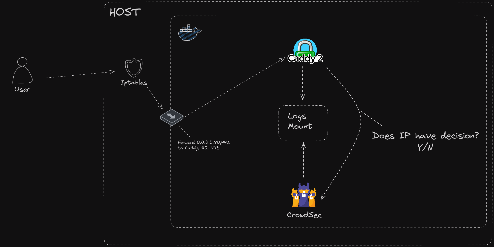

## Description

This example shows you a [Caddy](https://caddyserver.com/) example.



This example contains multiple containers :
* crowdsec : Read Caddy logs from the mounted volumes
* caddy : The Caddy container built using `xcaddy`

Before running the example, you need to create a api within the `.env` file. You can do this by running the following command :

```bash
echo "CROWDSEC_API_KEY=$(tr -dc A-Za-z0-9 </dev/urandom | head -c 32)" > .env
```

## Remediation

Hslatman has created a [Caddy module](https://github.com/hslatman/caddy-crowdsec-bouncer/tree/main) that can be used to block malicious IP addresses. We use this as the main caddy image and is built using the [Dockerfile](./Dockerfile). If you want to use TCP / UDP modules then please refer to Hslatman original repository.

**Prerequisites:** [Docker](https://docs.docker.com/engine/install/) / [Docker Compose](https://docs.docker.com/compose/install/)
