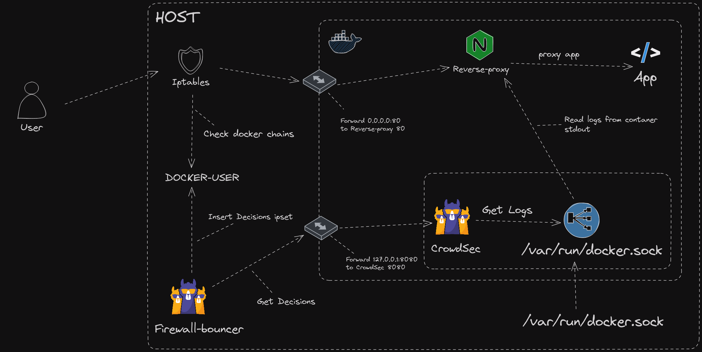

## Description

This example show how you can use the container socket to read logs from other containers without mounting volumes.

This example contains multiple containers :
* app : Tiny Go webserver that prints OS information and HTTP request to output.
* reverse-proxy : nginx that serving this app from the host
* crowdsec : it will read reverse-proxy logs from the socket

**Optional**
* socket-proxy: Nginx container that will expose container socket over TCP instead of mounting the socket directly into CrowdSec container

Even though this is classed as optional it is **highly** advised since it is not best practice to mount the docker socket directly into a container.

Attribution to [linux server](https://www.linuxserver.io/) team for the docker-socket-proxy container.

**Prerequisites:** [Docker](https://docs.docker.com/engine/install/) / [Docker Compose](https://docs.docker.com/compose/install/)

## Docker socket mounted to CrowdSec

Example above shows the docker socket mounted directly into the CrowdSec container. This is not best practice and should be avoided.

## Docker socket mounted to Socket-Proxy

Example above shows the docker socket mounted to the Socket-Proxy container. This is best practice and should be used instead of mounting the socket directly into the CrowdSec container.

## How does this setup work?

CrowdSec container will read logs from the socket and parse them to extract the IP address of the client. It will then send this IP address to the local API.

The firewall remediation is installed on the host and will read the local API to insert the IP address into the firewall.

Since docker uses NAT to forward it will use its own custom chains, so we must enable `DOCKER-USER` within the firewall-remediation configuration.