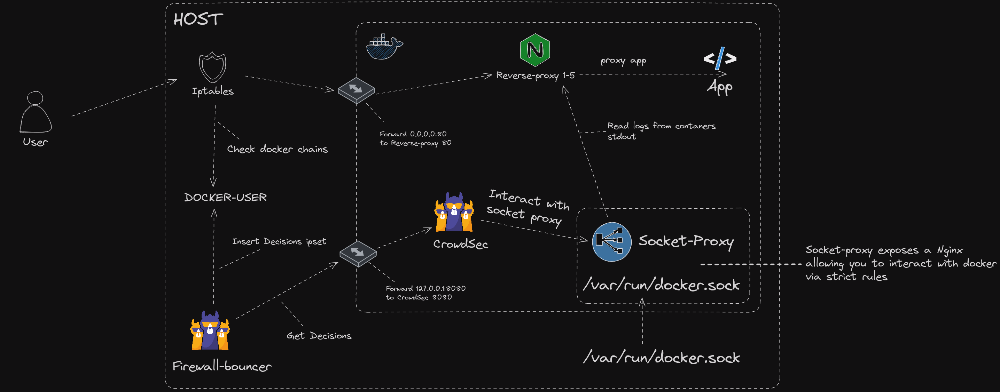

## Description

This example show how you can use the container labels to discover the containers you want to protect.

This example contains multiple containers :
* app : Tiny Go webserver that prints OS information and HTTP request to output.
* reverse-proxy : nginx that serving this app from the host
* crowdsec : it will read reverse-proxy logs from the socket
* socket-proxy: Nginx container that will expose container socket over TCP instead of mounting the socket directly into CrowdSec container

Attribution to [linux server](https://www.linuxserver.io/) team for the docker-socket-proxy container.

**Prerequisites:** [Docker](https://docs.docker.com/engine/install/) / [Docker Compose](https://docs.docker.com/compose/install/)



Example above shows the docker socket mounted to the Socket-Proxy container. This is best practice and should be used instead of mounting the socket directly into the CrowdSec container.

## How does this setup work?

CrowdSec container will request from the socket-proxy the running container information. If the running containers contains the label `crowdsec.enable=true` and `crowdsec.labels.type=<type>` it will be added to the CrowdSec configuration without having to specify the container name or regex. This is useful when running in a dynamic environment where containers are created and destroyed frequently.

# Testing Discovery with Labels

To test the discovery with labels, you can run the following command:

```bash
docker-compose up -d
```

This will start the following containers:
* app
* reverse-proxy
* crowdsec
* socket-proxy

You can check the logs of the crowdsec container to see the logs being processed:

```bash
docker-compose logs -f crowdsec
```

You should see the discovery of the first reverse proxy container:

```
crowdsec-1  | time="2024-06-09T14:12:48Z" level=info msg="start tail for container /container-labels-reverse-proxy-1" container_name=/container-labels-reverse-proxy-1 type=docker
```

You can then use the scale mechanism to add more reverse proxy containers:

```bash
docker compose scale reverse-proxy=3
```

You should see the discovery of the new reverse proxy containers:

```
crowdsec-1  | time="2024-06-09T14:12:48Z" level=info msg="start tail for container /container-labels-reverse-proxy-2" container_name=/container-labels-reverse-proxy-2 type=docker
crowdsec-1  | time="2024-06-09T14:12:48Z" level=info msg="start tail for container /container-labels-reverse-proxy-3" container_name=/container-labels-reverse-proxy-3 type=docker
```

However, this was already achievable via the `regex_name` configuration within the acquisition. The real power of this setup is when you have multiple compose files or containers running on the same host. 

For example:

```
docker run -d -l crowdsec.enable=true -l crowdsec.labels.type=nginx nginx:alpine
```

Now you can see the discovery of the new container:

```
crowdsec-1  | time="2024-06-09T14:21:38Z" level=info msg="start tail for container /modest_zhukovsky" container_name=/modest_zhukovsky type=docker
```

This means the CrowdSec container configuration did not need to be altered to discover the new container since the labels were set on creation. This works for all applications that are containerized and can be used to protect them without having to alter the CrowdSec configuration.

