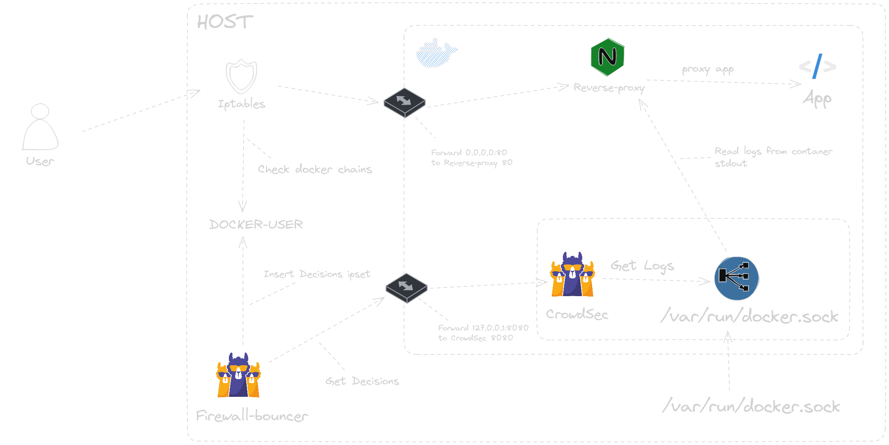
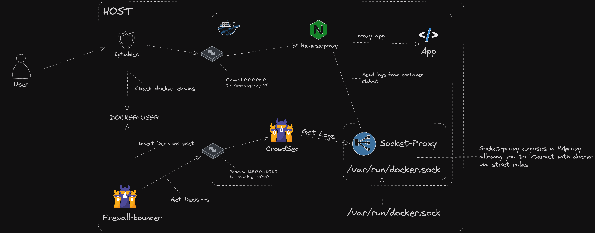

## Description

This example show how you can use the container socket to read logs from other containers without mounting volumes.

This example contains multiple containers :
* app : Tiny Go webserver that prints OS information and HTTP request to output.
* reverse-proxy : nginx that serving this app from the host
* crowdsec : it will read reverse-proxy logs from the socket

**Optional**
* socket-proxy: HAProxy that will expose container socket over TCP instead of mounting the socket directly into CrowdSec container

**Prerequisites:** [Docker](https://docs.docker.com/engine/install/) / [Docker Compose](https://docs.docker.com/compose/install/)

## Docker socket mounted to CrowdSec

## Docker socket mounted to Socket-Proxy

