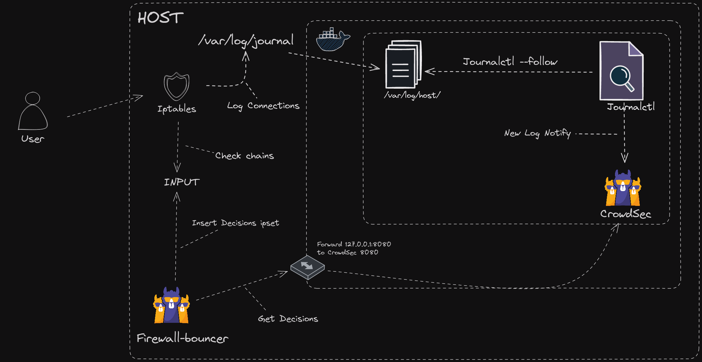

## Description

This example shows you how to use journald as a log source for CrowdSec.



This example is a single container :
* crowdsec : read journald logs and act on malicious behaviors

We will read journald via journalctl and act on iptables logs from the host. You **MUST** configure iptables to log to journald firstly see an example below:

```bash
# iptables -A INPUT -j LOG --log-prefix "iptables: "
```

**DISCLAIMER** we are not responsible for your iptables rules and their consequences, please be careful when using iptables. As it can be very easy to lock yourself out of your server.

**Prerequisites:** [Docker](https://docs.docker.com/engine/install/) / [Docker Compose](https://docs.docker.com/compose/install/)
