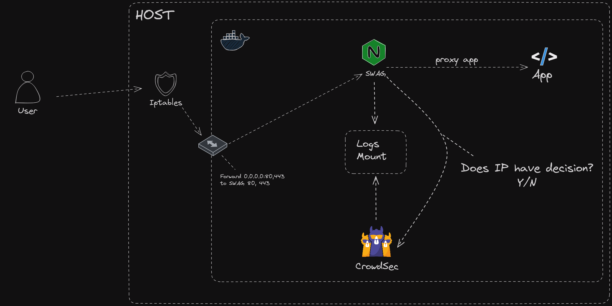

## Description

This example shows you a [SWAG](https://docs.linuxserver.io/general/swag) example. Thanks to [TheSpad](https://github.com/TheSpad) for creating the bouncer mod and writing a [blog article](https://www.linuxserver.io/blog/blocking-malicious-connections-with-crowdsec-and-swag) which this example is based on.



This example contains multiple containers :
* crowdsec : Read SWAG logs from the mounted volumes
* swag : The SWAG container
* whoami : A simple container to test the setup

Before running the example, you need to create a api within the `.env` file. You can do this by running the following command :

```bash
echo "CROWDSEC_API_KEY=$(tr -dc A-Za-z0-9 </dev/urandom | head -c 32)" > .env
```

**Prerequisites:** [Docker](https://docs.docker.com/engine/install/) / [Docker Compose](https://docs.docker.com/compose/install/)
